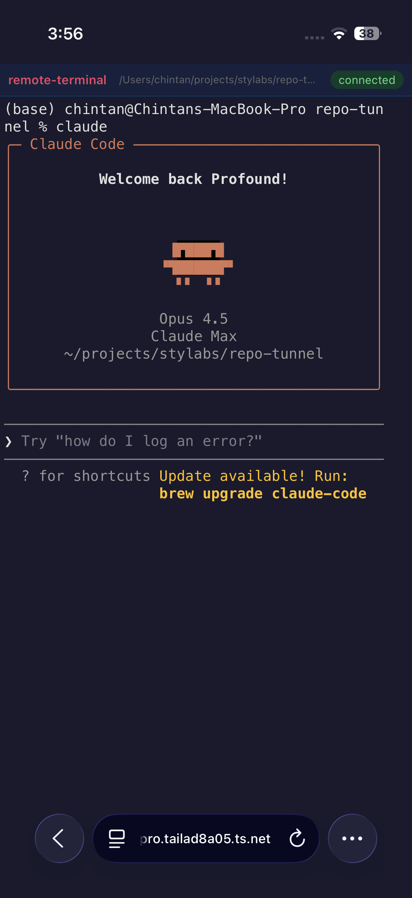
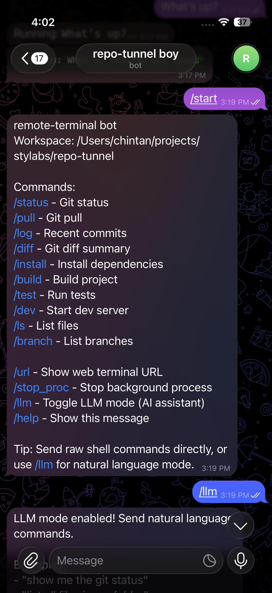
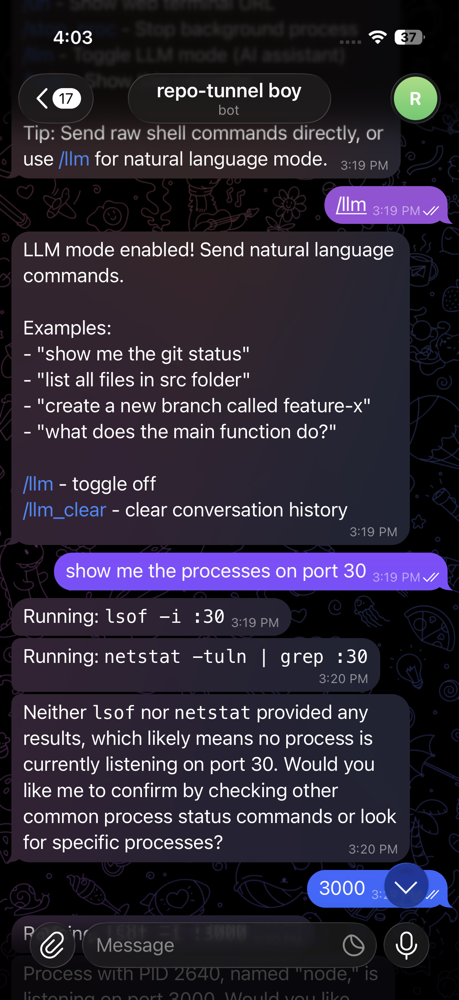

I built **remote-terminal** because I was tired of being tethered to my desk. Whether I'm on my phone waiting for a deploy, on my iPad at a coffee shop, or just away from my main machine — I wanted full access to my terminal without VPNs, port forwarding, or complex setup.

## Table of contents

## The Problem

As developers, we've all been there:

- You're out and need to check if a process is still running
- A deploy fails and you need to SSH in to investigate
- You want to run a quick git command but you're on your phone
- You need to restart a service but you're away from your laptop

The existing solutions are either too complex (setting up VPNs, exposing ports) or too limited (basic SSH apps that are painful on mobile).

## The Solution: remote-terminal

**remote-terminal** is an open-source CLI tool that gives you three ways to access your terminal:

1. **Web Terminal** — Full terminal in your browser, secured with Tailscale
2. **Telegram Bot** — Run commands directly from Telegram chat
3. **LLM Mode** — Natural language commands powered by AI

All secured through Tailscale's zero-trust network — no exposed ports, no complex firewall rules.

## How It Works

### 1. Web Terminal

Access a full xterm.js terminal from any browser. It's like SSH, but through a web interface that works great on tablets and even phones in a pinch.



The web terminal supports:
- Full ANSI color support
- Copy/paste
- Resize handling
- Persistent sessions

### 2. Telegram Bot

This is where it gets interesting. Connect a Telegram bot to your terminal and run commands directly from chat.



Available commands include:
- `/status` — Git status
- `/pull` — Git pull
- `/log` — Recent commits
- `/build` — Build project
- `/dev` — Start dev server
- Or just send any raw shell command

### 3. LLM Mode — The Game Changer

Here's what makes remote-terminal different. Toggle `/llm` mode and suddenly you can talk to your terminal in plain English:



Instead of remembering exact commands, just ask:

- *"show me the processes on port 3000"*
- *"how much RAM is node using?"*
- *"what's the git status?"*
- *"create a new branch called feature-auth"*

The LLM translates your intent into the right commands, executes them, and explains the results. It's like having a terminal assistant in your pocket.

## Security with Tailscale

Everything runs through Tailscale's mesh VPN:

- **No exposed ports** — Your terminal isn't accessible from the public internet
- **Zero-trust** — Only devices on your Tailnet can connect
- **End-to-end encrypted** — Traffic is encrypted between your devices
- **Works anywhere** — Tailscale punches through NATs and firewalls

## Quick Start

```bash
# Install
npm install -g remote-terminal

# Set up environment
export TAILSCALE_HOSTNAME="your-machine.tailnet-name.ts.net"
export TELEGRAM_BOT_TOKEN="your-bot-token"  # Optional
export OPENAI_API_KEY="your-key"  # Optional, for LLM mode

# Run
remote-terminal
```

That's it. Your terminal is now accessible from:
- `https://your-machine.tailnet-name.ts.net` (web)
- Your Telegram bot (if configured)

## Use Cases

**On-call debugging**: Get paged at 2am? Check logs and restart services from your phone without getting out of bed.

**Coffee shop coding**: Left your laptop at home but have your iPad? Full terminal access through the browser.

**Quick checks**: Waiting in line? Check if your deploy succeeded via Telegram.

**Teaching/Demos**: Show your terminal to others through a secure web link.

**AI-assisted ops**: Not sure of the exact command? Just describe what you want in LLM mode.

## Open Source

remote-terminal is fully open source. Check it out:

- **Website**: [remote-terminal.top](https://remote-terminal.top)
- **GitHub**: [github.com/anthropics/remote-terminal](https://github.com/anthropics/remote-terminal)

Contributions welcome — whether it's new features, bug fixes, or documentation improvements.

## What's Next

I'm actively working on:
- **Session persistence** — Resume where you left off
- **Multi-workspace support** — Manage multiple machines
- **Slash commands** — Quick actions for common tasks
- **Mobile app** — Native iOS/Android experience

If you try it out, I'd love to hear your feedback. Drop me a message or open an issue on GitHub.

---

*remote-terminal is built with Node.js, xterm.js, Tailscale, and love for the command line.*
